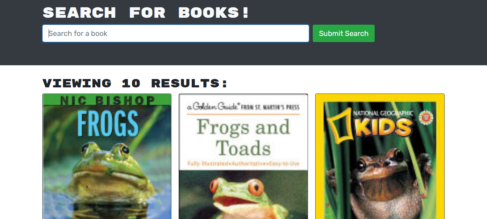

# Shelf Stable

## Description

Shelf Stable uses the Google Books API to allow users to search for books and save them to their personal book shelf.

## Table of Contents

[Installation](#installation)

[Usage](#usage)

[Contributing](#contributing)

[Questions](#questions)

## Installation
Visit the [homepage](https://floating-basin-36620.herokuapp.com/) and sign up for an account.

## Usage

Once logged in, simply search for a book you're interested in. Google Books will return results, where you'll see a cover image and details about the book. To save a book, click the button and it will be saved to your profile for future reference.

## Contributing
The back end for this application uses GraphQL, the front end is built with React.

## Questions
You can check out my other projects on [GitHub](https://www.github.com/soundproofboot). Please contact me with any further questions.